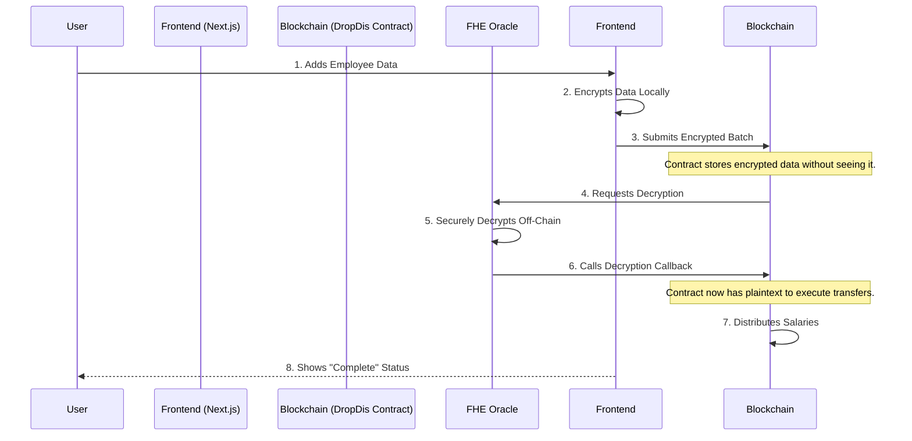

# DropDis: Encrypted Salary Distribution on fhEVM


> **Where privacy meets payroll.** DropDis is a groundbreaking DApp that leverages Zama's fhEVM to enable fully confidential salary distributions. Pay your team without ever revealing sensitive financial data on the public blockchain.

---

## Key Features

- **End-to-End Encryption**: Employee addresses and salaries are encrypted on the client-side and remain private throughout the entire process.
- **Efficient Batch Processing**: Distribute salaries to hundreds of employees in a single, gas-optimized transaction.
- **Real-Time UI Feedback**: Watch as each employee's data is encrypted with a beautiful, responsive interface that shows live status updates.
- **Interactive Dashboard**: Get a complete, historical overview of all salary batches, their status, and detailed payout information.
- **Built on fhEVM**: Powered by Zama's revolutionary Fully Homomorphic Encryption, ensuring computations on encrypted data without decryption.
- **Modern Tech Stack**: Built with the best tools in the industry: Next.js 16, TypeScript, Tailwind CSS, and Hardhat.

## How It Works: The Magic of FHE

Traditional blockchains are public. With fhEVM, DropDis can perform calculations on encrypted data. Think of it like sending a locked box to the blockchain. The contract can verify the total amount inside the box is correct, but it can't see what's inside until you, the owner, provide the special key.



## Technology Stack

### Blockchain Layer

| Technology       | Description                  |
| :--------------- | :--------------------------- |
| **Blockchain**   | Zama fhEVM (Sepolia Testnet) |
| **Language**     | Solidity `^0.8.24`           |
| **Environment**  | Hardhat                      |
| **Core Library** | `@fhevm/contracts`           |

### Frontend Layer

| Technology        | Description                    |
| :---------------- | :----------------------------- |
| **Framework**     | Next.js 16 (App Router)        |
| **Language**      | TypeScript                     |
| **Styling**       | Tailwind CSS                   |
| **Web3 Library**  | Ethers.js v6                   |
| **FHE Library**   | `@zama-fhe/relayer-sdk/bundle` |
| **Notifications** | Sonner                         |

---

## Getting Started

### Prerequisites

- Node.js `v18+`
- `pnpm` (recommended), `npm`, or `yarn`
- A Web3 wallet (e.g., MetaMask) with the Zama Sepolia network configured.
- Some Sepolia testnet ETH.

### 1. Clone & Install

```bash
git clone https://github.com/your-username/drop-dis.git
cd drop-dis

# Install dependencies
pnpm install

```

### 2. Environment Setup

Create environment file:

**`frontend/.env.local`**

```env
MNEMONIC=
INFURA_API_KEY=
ETHERSCAN_API_KEY=

NEXT_PUBLIC_CONTRACT_ADDRESS=0x684468E7fe477AaB7525573106eB88F3D18B9Ce2
PRIVATE_KEY=
BATCH_SIZE=50
```

### 3. Compile & Deploy Contract

```bash
# Compile the Solidity code
pnpm compile

# Deploy to Sepolia testnet
pnpm deploy:sepolia
```

### 4. Run the Frontend

From the `frontend` directory:

```bash
pnpm dev
```

Navigate to [http://localhost:3000](http://localhost:3000) to start using DropDis!

---

## Usage Guide

1.  **Connect Wallet**: Ensure your wallet is connected to the Sepolia network.
2.  **Add Employees**: Enter an employee's address and salary. Click **Add Employee**.
3.  **Monitor Encryption**: The employee appears in the list with a loading spinner. Once encrypted, it turns green. You can add multiple employees simultaneously.
4.  **Distribute**: Once all employees are encrypted, the **Distribute Now** button becomes active. Click it to submit the batch to the blockchain.
5.  **Track Progress**: The UI shows the live status of the decryption and payment process.
6.  **View History**: Visit the `/dashboard` to see a complete history of all salary batches. #Coming Soon

---

## Running Tests

This project uses the Zama FHE mock environment for testing, which simulates the entire encryption/decryption flow.

```bash
# From the /contracts directory
pnpm test
```

---

## Project Structure

```
## Project Structure

DROP-DIS/
│
├── app/                                # Next.js 16 App Router (frontend pages)
│   ├── favicon.ico                     # Website favicon
│   ├── globals.css                     # Global Tailwind / CSS styles
│   ├── layout.tsx                      # Root layout wrapper for pages
│   ├── page.tsx                        # Main landing page of the DApp
│
├── components/                         # Reusable React components for UI
│   ├── BatchStatus.tsx                 # Component to show batch processing status
│   ├── Card.tsx                        # UI card to display employee info
│   ├── EmployeeForm.tsx                # Form to add new employees with encryption
│   ├── EmployeeList.tsx                # List displaying all employees
│   └── FHEVM.tsx                       # Handles Zama FHEVM initialization logic
│
├── contracts/                          # Solidity smart contracts
│   └── DropDis.sol                     # Main contract handling encrypted distribution
│
├── deploy/                             # Deployment scripts for Hardhat
│   └── deploy.ts                       # Script to deploy DropDis.sol to the network
│
├── deployments/                        # Stores deployed contract addresses & metadata
│
├── ignition/                           # Hardhat Ignition scripts (structured deployment)
│
├── lib/                                # Custom libraries (optional utilities or hooks)
│
├── public/                             # Static assets (images, fonts, etc.)
│
├── test/                               # Smart contract tests
│   └── dropDis.test.ts                 # Unit tests for DropDis contract
│
├── types/                              # TypeScript type definitions (e.g. contract types)
│
├── utils/                              # Helper functions and config files
│   ├── abi/
│   │   ├── DropDis.json                # Compiled ABI of DropDis.sol
│   │   └── ABI.ts                      # ABI export helper for frontend
│   ├── contract.ts                     # Ethers.js contract interaction setup
│   └── fheClient.ts                    # Zama FHEVM client initialization (encrypt/decrypt)
│
├── .env                                # Environment variables (private keys, RPC URLs)
│
├── package.json                        # NPM dependencies and scripts
├── hardhat.config.ts                   # Hardhat configuration file
├── tsconfig.json                       # TypeScript configuration
├── next.config.js                      # Next.js configuration
└── README.md                           # Project documentation (GitHub)

```

---

## Contributing

We welcome contributions! Whether it's a bug fix, a new feature, or an improvement to the documentation, your help is appreciated.

1.  **Fork** the repository.
2.  Create your feature branch (`git checkout -b feature/amazing-feature`).
3.  **Commit** your changes (`git commit -m 'Add some amazing feature'`).
4.  **Push** to the branch (`git push origin feature/amazing-feature`).
5.  Open a **Pull Request**.

---

## Refercens

- A huge thanks to the **[Zama](https://www.zama.ai/)** team for building the future of confidential smart contracts.
- Built with the amazing tools from **[Hardhat](https://hardhat.org/)**, **[Next.js](https://nextjs.org/)**, and **[Tailwind CSS](https://tailwindcss.com/)**.
